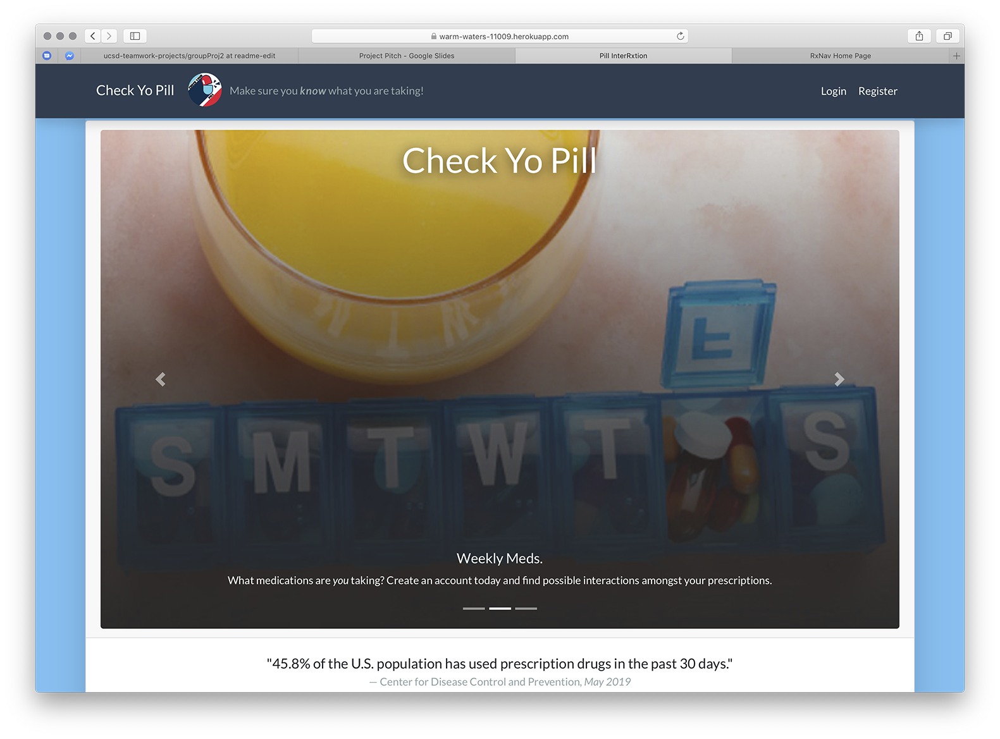
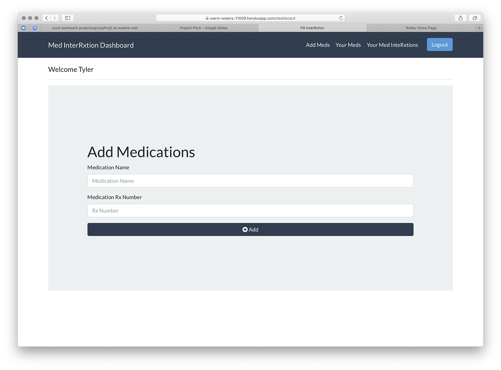
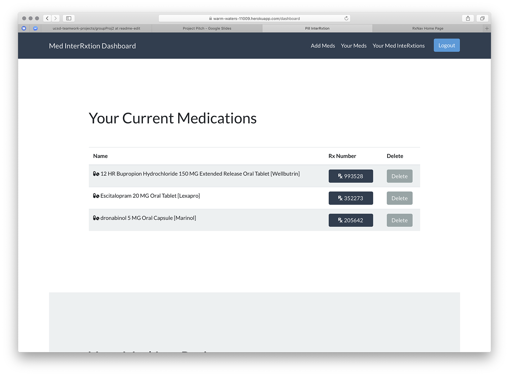
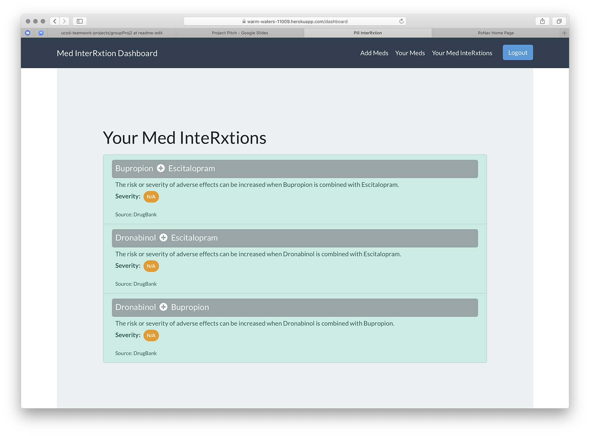

# CHECK YO PILL

------

##INTRODUCTION

Full-Stack Application designed to check for Adverse Reactions between prescribed medicine.

Features the following technologies to deliver our Five Concepts: 

- Node.js
- Express
- Handlebars
- Passport
- MySQL
- Sequelize
- Travis CI
- Mocha
- Bootstrap

##FIVE CONCEPTS

1. Responsive Landing Page
2. Interactive User Dashboard
3. Passport-based SSL Authorization
4. Active RESTful API Implementation
5. U.S. NIH-Certified Medical Information

####1.  RESPONSIVE LANDING PAGE

Features Image Carousel and written introduction.

####2.   INTERACTIVE USER DASHBOARD

Add Medication finds the user's prescription with proper dosage, and provides RxUI Number to reference.

Lists all user's prescriptions.

Finally, possible interactions are displayed.

#### 3.  PASSPORT-BASED SSL AUTHORIZATION

Passport's Authorization code is embedded as a Node Package Module to provide password protection for the user's account.

#### 4.  ACTIVE RESTFUL API IMPLEMENTATION

Custom API's were written using REST standards, implementing methods like GET and POST to send data from our server's to the clients browser.

#### 5.  U.S. NIH-Certified Medical Information

The statements we use are pulled from the U.S. National Insitute of Health's databases using their RxNorm API.